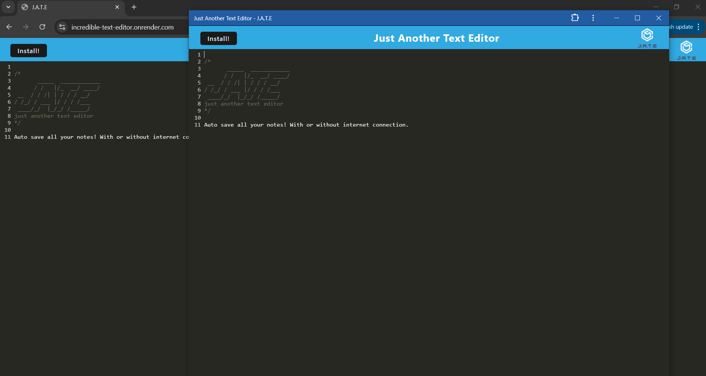

# Incredible Text Editor

## Description
A Progressive Web Application (PWA) text editor that allows users to create, edit, and save notes or code snippets with or without an internet connection. The application utilizes IndexedDB for data persistence and can be installed on a user's device.

### Features
 * Offline Functionality: The application works without an internet connection, using IndexedDB to store and retrieve content.
 * Data Persistence: Content is saved automatically in IndexedDB when the user navigates away from the page.
 * Service Worker: Utilizes Workbox to cache static assets, ensuring the app loads quickly and reliably.
 * Installable: Users can install the application on their devices as a Progressive Web App (PWA).

## Table of Contents
* [Installation](#installation)
* [Usage](#usage)
* [License](#license)
* [Contributing](#contributing)
* [Tests](#tests)
* [Credits](#credits)
* [Questions](#questions)

## Installation
Installation instructions: run "npm i"

## Usage
View the deployed application [here](https://incredible-text-editor.onrender.com/)

 * Text Editor: Use the editor to create and modify notes or code snippets.
 * Save and Retrieve: Content is automatically saved in IndexedDB. Reopen the editor to retrieve previously saved content.
 * Install: Click on the "Install" button to add the app to your device's home screen for easy access.

## License
This project is licensed under the MIT license. Please feel free to read the license in full detail [here](https://opensource.org/license/mit)

## Contributing
Please contact me regarding contributions to the repo.

## Tests
N/A

## Credits
N/A

## Questions
Please contact me with any additional questions.

Github: hannahpsmith (https://github.com/hannahpsmith)

Email: hannahpsmith94@gmail.com
